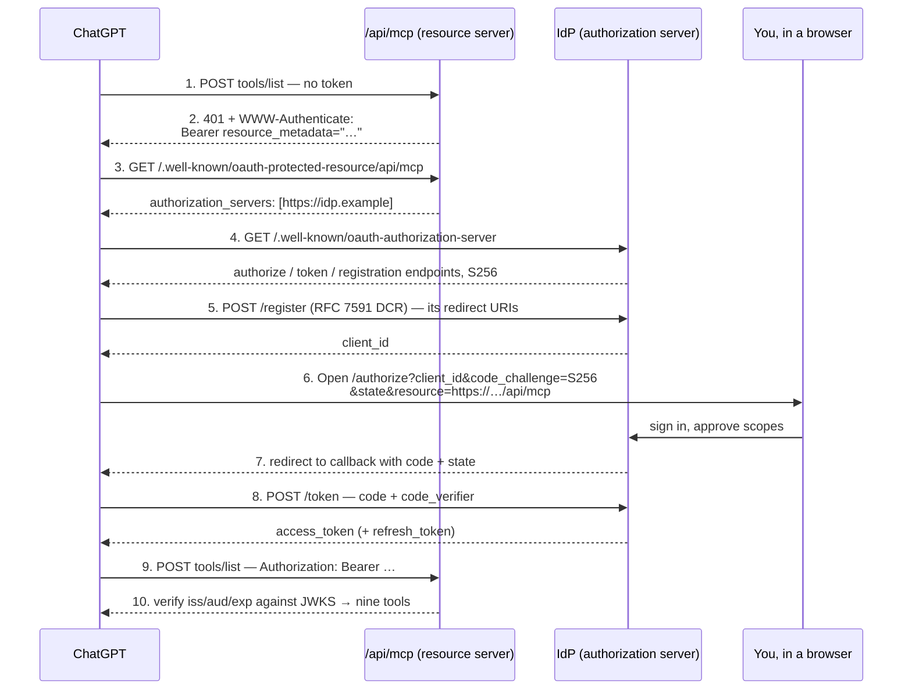

# Running the MCP server, reaching it from ChatGPT, and syndicating posts

Three things in one runbook, because they share a spine — the drafting control
plane in `mcp/`:

1. **Run the server** as it exists today (Claude Code, stdio).
2. **Give ChatGPT access** by adding an HTTP transport and hosting it.
3. **Get published posts onto other sites** — client sites, and third-party
   platforms like DEV and Hashnode.

**Read the status marker on every section.** Parts 1–3 describe code that now
exists. Parts 4–5 are runbooks for work that has **not been built**, and their
code blocks are files to write, not files to read.

| Part | Status |
| --- | --- |
| 1 — Run it locally (Claude Code) | ✅ **Built.** Verified 2026-08-10 |
| 2 — HTTP transport | ✅ **Built** as a Vercel route handler ([§2.4](#24-the-vercel-route-handler-built)). The standalone `mcp/http.ts` in §2.2 is still hypothetical |
| 2b — OAuth 2.1 on that transport | ✅ **Built.** Discovery, DCR, authorize/token/revoke, bearer validation, scopes ([§3.4](#34-oauth-what-was-built-and-how-the-flow-works)) |
| 3 — ChatGPT connector | ✅ **Built, migration applied, grant verified end to end** against the live database on 2026-08-10. Only the ChatGPT-side connector registration remains ([§3.2](#32-steps)) |
| 4 — Posting to other sites you control | ⚠️ **Partly built.** The registry path works; nothing else exists |
| 5 — Syndication (DEV, Hashnode, Medium, LinkedIn) | ❌ Not built. No RSS feed, no API routes, no tokens |

**What was built on 2026-08-10**

**Transport and tools**

| File | Change |
| --- | --- |
| `src/app/api/mcp/route.ts` | New. Remote MCP endpoint over Streamable HTTP, OAuth-protected. Every handler is wrapped so a throw returns a JSON-RPC `-32603` rather than Next's HTML error page — see the note below |
| `mcp/writing-guide.ts` | New. The drafting brief, served to the model |
| `mcp/tools.ts` | Added `get_writing_guide`, later `check_seo` (nine tools); split into scope-gated registration groups |
| `mcp/sites.ts` | `SITES_ENABLED` allowlist, enforced in `resolveSite` |
| `mcp/lib.ts` | Guarded `import.meta.dirname` so the module survives bundling |
| `src/app/robots.ts` | Disallow `/api/mcp` and `/oauth` |
| `package.json` | `@modelcontextprotocol/sdk` and `sharp` moved to `dependencies` |

**OAuth 2.1 authorization server** — no new npm dependencies; `node:crypto` plus
the SDK's own wire schemas.

| File | Change |
| --- | --- |
| `supabase/migrations/20260810120000_add_mcp_oauth.sql` | New. `oauth_clients`, `oauth_authorization_codes`, `oauth_tokens`; RLS on with **no policies** (service-role only) |
| `src/lib/supabase/database.types.ts` | The three tables, plus `OAuthTokenKind` and `Json` |
| `src/lib/mcp-auth/config.ts` | Scopes, TTLs, issuer/resource URLs, `MCP_OAUTH_ENABLED` |
| `src/lib/mcp-auth/crypto.ts` | Token generation, SHA-256 storage hashing, PKCE S256 verification |
| `src/lib/mcp-auth/store.ts` | All OAuth database access: clients, codes, tokens, refresh rotation |
| `src/lib/mcp-auth/params.ts` | Pure request parsing and redirect building (no `server-only`) |
| `src/lib/mcp-auth/authorize-request.ts` | Authorization-request validation, shared by page and action |
| `src/lib/mcp-auth/actions.ts` | Approve / deny consent Server Actions |
| `src/lib/mcp-auth/bearer.ts` | Bearer extraction, audience check, `WWW-Authenticate` challenge |
| `src/app/.well-known/oauth-authorization-server/route.ts` | RFC 8414 metadata |
| `src/app/.well-known/oauth-protected-resource/api/mcp/route.ts` | RFC 9728 metadata |
| `src/app/oauth/register/route.ts` | RFC 7591 dynamic client registration |
| `src/app/oauth/authorize/page.tsx` | Consent screen, reusing the Supabase admin login |
| `src/app/oauth/authorize/error/page.tsx` | Terminal error for un-redirectable requests |
| `src/app/oauth/token/route.ts` | `authorization_code` + `refresh_token` grants |
| `src/app/oauth/revoke/route.ts` | RFC 7009 revocation |
| `src/lib/blog/authz.ts` | `safeAdminRedirect` allows `/oauth/authorize`, and is hardened |
| `scripts/verify-mcp-oauth.mts` | New. 31-assertion end-to-end verification of the grant |
| `package.json` | `npm run verify:mcp-oauth` |

**Removed:** `src/app/api/mcp/[secret]/route.ts` and `MCP_URL_SECRET`. The
secret-in-URL credential is superseded by OAuth — see
[§3.3](#33-choosing-an-auth-method-honestly).

> **Errors leave as JSON-RPC, never as HTML.** `POST`/`GET`/`DELETE` each wrap
> `handle()`, so anything thrown past the bearer check — tool registration,
> `server.connect`, `transport.handleRequest` — comes back as
> `{"jsonrpc":"2.0","error":{"code":-32603,...}}` with Next's `digest` attached
> under `error.data` where one exists. Before this, an MCP client got
> `<!DOCTYPE html>` and reported a parse failure, which hides the real cause and
> fills logs with markup. **When a 500 does happen, quote the `digest`** — that
> is what ties the response to a line in the platform logs.
>
> An HTML 500 from `/api/mcp` therefore means the failure is *below* this code —
> the route never ran. Check the deployment, not the handler. `x-matched-path:
> /500` in the response headers confirms it: the request never matched the
> route at all.

> ⚠️ `.env.example` documents `MCP_OAUTH_ENABLED` and `SITES_ENABLED`, but **that
> file is untracked** — `.gitignore` line 34 is `.env*`, so the edit is local-only
> and won't reach a fresh clone. The deploy table in
> [§3.2](#32-steps) is the authoritative copy. Committing the template needs a
> `!.env.example` negation, which is your call since it holds real (publishable)
> values.

Companion documents: [`PUBLISHING_BLOGS.md`](PUBLISHING_BLOGS.md) for how to
write and publish a post, [`ONBOARD_A_SITE.md`](ONBOARD_A_SITE.md) for adding a
site to the registry, [`MULTI_SITE_PLAN.md`](MULTI_SITE_PLAN.md) for the
architecture decisions this runbook is bound by.

---

## Contents

1. [Run the server locally](#1-run-the-server-locally)
2. [Add an HTTP transport](#2-add-an-http-transport)
3. [Connect it to ChatGPT](#3-connect-it-to-chatgpt)
4. [Posting to other sites you control](#4-posting-to-other-sites-you-control)
5. [Syndicating to third-party platforms](#5-syndicating-to-third-party-platforms)
6. [Complete endpoint reference](#6-complete-endpoint-reference)
7. [Security rules that must not be broken](#7-security-rules-that-must-not-be-broken)
8. [Build order and effort](#8-build-order-and-effort)

---

## 1. Run the server locally

**Status: built.**

### 1.1 What you need

| Requirement | Notes |
| --- | --- |
| Node ≥ 20.11 | `mcp/lib.ts` uses `import.meta.dirname`. Verified on v26.5.0 |
| `npm install` | `tsx` is a **devDependency**, so `npm ci --omit=dev` will not run the *stdio* server. The deployed HTTP route needs no `tsx` — Next compiles `mcp/*.ts` |
| `.env.local` with credentials | See below |
| An `owner` profile in each site's Supabase | `create_draft` attributes posts to it and **fails without one** |

### 1.2 Credentials

`mcp/lib.ts` reads `.env.local` from the repo root with a minimal parser, then
overlays `process.env` — **real environment variables win over the file**, which
is what makes a hosted run possible later without shipping a dotfile.

For `denalixtech` (the one site carrying `legacyEnv: true`):

```bash
NEXT_PUBLIC_SUPABASE_URL=https://<ref>.supabase.co
SUPABASE_SERVICE_ROLE_KEY=sb_secret_...
```

For every other site, by the convention in `mcp/sites.ts` — key uppercased,
hyphens to underscores:

```bash
SITE_CLIENT_A_SUPABASE_URL=https://<ref>.supabase.co
SITE_CLIENT_A_SERVICE_ROLE_KEY=sb_secret_...
```

> `NEXT_PUBLIC_SUPABASE_URL` in the committed `.env.example` ends in
> `/rest/v1/`. `createClient` expects the bare project origin
> (`https://<ref>.supabase.co`). If reads fail with 404s, check this first.

### 1.3 Register it with Claude Code

Already done — `.mcp.json` at the repo root:

```json
{
  "mcpServers": {
    "denalix-blog": {
      "command": "npx",
      "args": ["tsx", "mcp/server.ts"]
    }
  }
}
```

Claude Code launches it over stdio and restarts it with the session. **Restart
Claude Code once** after pulling changes to `mcp/`. There is nothing to start
manually and no port to keep open.

### 1.4 Smoke-test it without an editor

The fastest way to prove the server boots, resolves credentials, and exposes its
tools — speak JSON-RPC at it directly:

```bash
printf '%s\n%s\n%s\n' \
  '{"jsonrpc":"2.0","id":1,"method":"initialize","params":{"protocolVersion":"2025-06-18","capabilities":{},"clientInfo":{"name":"smoke","version":"0"}}}' \
  '{"jsonrpc":"2.0","method":"notifications/initialized"}' \
  '{"jsonrpc":"2.0","id":2,"method":"tools/list","params":{}}' \
  | npx tsx mcp/server.ts
```

Expected: a `serverInfo` of `denalix-blog` v2.0.0, then **nine** tools —
`list_sites`, `get_writing_guide`, `list_posts`, `check_slug`, `check_seo`,
`get_link_targets`, `suggest_internal_links`, `generate_cover_image`,
`create_draft`. Each
site-scoped tool's schema should list your real site keys in its `site`
description; if it says `One of: denalixtech` and you expected three, your
registry entries are missing, not your credentials.

To exercise a tool that actually touches Supabase, append:

```bash
'{"jsonrpc":"2.0","id":3,"method":"tools/call","params":{"name":"list_posts","arguments":{"site":"denalixtech"}}}'
```

### 1.5 Troubleshooting

| Symptom | Cause |
| --- | --- |
| `Missing Supabase credentials for site "<key>"` | Env var names don't match the `SITE_<KEY>_*` convention, or `.env.local` isn't at the repo root |
| `No owner profile found for "<key>"` | That project has an Auth user but no `profiles` row with `role = 'owner'`. README §6 |
| `Unknown site "<key>". Valid sites: …` | Working as designed. Exact match only — no fuzzy matching, no default |
| Tools absent in Claude Code | The server crashed at startup. Run §1.4 to see the real error; stdio swallows it otherwise |
| Cover generation throws | `sharp` missing or built for the wrong platform. `npm rebuild sharp` |
| Slug rejected but looks fine | `check_slug` returns a `suggestion` — use it. Format is `^[a-z0-9]+(?:-[a-z0-9]+)*$` |

---

## 2. Add an HTTP transport

**Status: built — as a Vercel route handler ([§2.4](#24-the-vercel-route-handler-built)).**
§2.1 applies to any hosted transport and is done. §2.2–§2.3 describe a
**standalone** `mcp/http.ts` that was **not** built; read them only if you later
move off Vercel.

ChatGPT cannot launch a local process. It connects only to a **remote MCP server
over public HTTPS** speaking Streamable HTTP or SSE
([OpenAI Help Center](https://help.openai.com/en/articles/12584461-developer-mode-and-mcp-apps-in-chatgpt)).
So the server needs a second transport.

`mcp/server.ts` is already reduced to transport-and-wiring for exactly this
reason — the tool surface in `tools.ts` is reused unchanged.

### 2.1 Shrink the blast radius (done)

The stdio server holds **every registered site's service-role key** and bypasses
RLS. Putting that process on the public internet is a materially different
proposition from running it on your laptop, and
[`MULTI_SITE_PLAN.md`](MULTI_SITE_PLAN.md) D5/D6 say so.

The exposure is bounded but real. There is no publish tool and no delete
function, so the worst an unauthenticated caller can do is enumerate post titles
and slugs, insert unlimited draft rows, and fill a storage bucket with generated
covers — **on all three sites at once**.

**Do this first, in one small change:** make the hosted process carry only the
sites you intend to expose.

```ts
// mcp/sites.ts — add to loadSites()
export function loadSites(): SiteConfig[] {
  const allow = env.SITES_ENABLED?.split(",").map((k) => k.trim().toLowerCase());
  if (!allow?.length) return sites;
  return sites.filter((site) => allow.includes(site.key.toLowerCase()));
}
```

Then `resolveSite` must filter the same list, or the allowlist is decorative.
Run the hosted instance with `SITES_ENABLED=denalixtech` and omit the client
`SITE_*_SERVICE_ROLE_KEY` vars from its environment entirely — a key that isn't
deployed cannot leak. Client sites keep the local stdio path, which is where
they belong.

### 2.2 The transport

Stateless mode: a fresh `McpServer` and transport per request, no session state
to lose across restarts or instances.

```ts
// mcp/http.ts — NOT COMMITTED. Create this file.
import { createServer } from "node:http";
import { timingSafeEqual } from "node:crypto";

import { McpServer } from "@modelcontextprotocol/sdk/server/mcp.js";
import { StreamableHTTPServerTransport } from "@modelcontextprotocol/sdk/server/streamableHttp.js";

import { registerBlogTools } from "./tools";
import { env } from "./lib";

const PORT = Number(env.MCP_PORT ?? 8787);
// Illustrative only. The deployed route uses OAuth (§3.4), not a path secret —
// if you ever build this standalone server, port the bearer check across rather
// than reviving a static credential. See §7 rule 7.
const SECRET = env.MCP_URL_SECRET;

function authorized(url: URL): boolean {
  if (!SECRET) return true; // local development only
  const given = url.pathname.split("/")[2] ?? "";
  const a = Buffer.from(given);
  const b = Buffer.from(SECRET);
  return a.length === b.length && timingSafeEqual(a, b);
}

createServer(async (req, res) => {
  const url = new URL(req.url ?? "/", `http://${req.headers.host}`);

  if (url.pathname === "/healthz") {
    res.writeHead(200, { "content-type": "application/json" });
    res.end(JSON.stringify({ ok: true }));
    return;
  }

  if (!url.pathname.startsWith("/mcp") || !authorized(url)) {
    res.writeHead(404).end();
    return;
  }

  // Stateless: one server + transport per request.
  const server = new McpServer({ name: "denalix-blog", version: "2.0.0" });
  registerBlogTools(server);

  const transport = new StreamableHTTPServerTransport({
    sessionIdGenerator: undefined,
  });

  res.on("close", () => {
    void transport.close();
    void server.close();
  });

  await server.connect(transport);
  await transport.handleRequest(req, res);
}).listen(PORT, () => {
  console.error(`MCP HTTP listening on :${PORT}`);
});
```

`handleRequest` parses the body itself when you don't pass a pre-parsed one, and
handles `POST`, `GET` (the SSE stream), and `DELETE` on the same path. Leave
`enableJsonResponse` at its default — ChatGPT expects the SSE stream.

Add to `package.json`:

```json
"scripts": { "mcp:http": "tsx mcp/http.ts" }
```

Verify locally before exposing anything:

```bash
npm run mcp:http

curl -sS http://localhost:8787/mcp \
  -H 'content-type: application/json' \
  -H 'accept: application/json, text/event-stream' \
  -d '{"jsonrpc":"2.0","id":1,"method":"tools/list","params":{}}'
```

> **`accept: application/json, text/event-stream` is required.** The Streamable
> HTTP spec mandates both media types on POST; omitting one returns a 406 and
> looks like a server bug.

### 2.3 Hosting

Per D6, this is a **standalone deployment — never a route handler in
`denalix-noir`**. A marketing-site deploy must not be able to break three
clients' publishing pipeline, and a compromise of the marketing site must not
reach their credentials.

| Option | Notes |
| --- | --- |
| **Cloudflare Tunnel to your laptop** | Zero hosting cost, nothing persistent to attack, and the tunnel dies when you close it. Best for a time-boxed trial |
| **Fly.io / Railway / Render** | ~$2–5/mo, Node-native so `sharp` works. Right answer if this becomes routine |
| **Cloudflare Workers** | ❌ No Node runtime — cover generation breaks |
| **Vercel, as a route handler in `denalix-noir`** | ✅ **What is deployed.** See [§2.4](#24-the-vercel-route-handler-built) — conditionally acceptable, with one hard line |
| **Vercel, as a second project** | ✅ Respects D6, same platform you already use |

**Three packages must move from `devDependencies` to `dependencies` before any
real deploy** — `@modelcontextprotocol/sdk`, `sharp`, and `tsx`. All three are
runtime requirements of the server and none survives a production install today.
Prefer compiling with `tsc` and dropping `tsx` over shipping a TS loader. (The
Vercel route-handler path in §2.4 needs neither `tsx` nor a `tsc` step — Next
compiles `mcp/*.ts` as part of the build.)

### 2.4 The Vercel route handler (built)

**Status: built and tested end to end on 2026-08-10.** This is the path in use.

Deploying this repo to Vercel *without* a route handler would give ChatGPT
nothing to connect to: Vercel runs `next build` and serves the Next app, and
`mcp/server.ts` is a stdio process that nothing on Vercel launches — no port, no
URL, no listener. So the endpoint is a route handler: `src/app/api/mcp/route.ts`.

**The D6 conflict, and where it actually bites.**
[`MULTI_SITE_PLAN.md`](MULTI_SITE_PLAN.md) D6 says the control plane must never
be a route handler in a marketing site, for two reasons: a marketing-site deploy
should not be able to break three clients' publishing, and a compromise of the
marketing site should not reach three clients' credentials.

The second reason is the load-bearing one, and it is conditional:

- **`denalixtech` only** — this Vercel project **already holds** Denalix's own
  `SUPABASE_SERVICE_ROLE_KEY`, because `/admin/people` needs it. Adding an MCP
  route that uses the same key exposes **no new class of secret**. Defensible.
- **The moment you add a client's `SITE_*_SERVICE_ROLE_KEY` to this project**,
  D6 bites exactly as written. Don't. Run client sites through local stdio, or a
  second Vercel project.

So: set `SITES_ENABLED=denalixtech` ([§2.1](#21-shrink-the-blast-radius-done))
and keep client keys out of this project's environment. The first reason —
deploy coupling — remains real but survivable for a one-person team.

**The transport class differs from §2.2.** Route handlers speak Web
`Request`/`Response`, so the route uses
`WebStandardStreamableHTTPServerTransport`, not the `node:http`
`StreamableHTTPServerTransport`. Read the file for the rest; its header comment
carries the security constraints.

`POST`, `GET` (the SSE stream), and `DELETE` all route to one handler. Stateless
mode (`sessionIdGenerator: undefined`) is mandatory — serverless invocations
share no memory.

**Access control lives in OAuth, not in this route.** The endpoint is
`/api/mcp` — no secret path segment — and every request must carry a bearer token
issued by the authorization server in [§3.4](#34-oauth-what-was-built-and-how-the-flow-works).
Deploy configuration is in [§3.2](#32-steps).

**What this needed, and what it didn't:**

| Concern | Outcome |
| --- | --- |
| `sharp` bundling | ✅ Already on Next's auto-external list. No `serverExternalPackages` entry. Verified rendering a real 62 KB PNG through the bundled route |
| `tsx` | ✅ Not needed — Next compiles `mcp/*.ts`. Stays a devDependency |
| `@modelcontextprotocol/sdk`, `sharp` | ✅ Moved to `dependencies`. Both are runtime code now |
| Env vars | `mcp/lib.ts` overlays `process.env` over a missing `.env.local`, so real env wins — the designed behavior |
| `import.meta.dirname` in `mcp/lib.ts` | ⚠️ **Was a build failure, now fixed.** Turbopack leaves it `undefined`, and `resolve(undefined, "..")` threw at module evaluation — `Failed to collect page data`. It is computed at module scope, *outside* `loadEnv`'s `try`, so the `catch` never saw it. Now guarded |
| `dynamic` on the two `.well-known` routes | ⚠️ **Was a bug, now fixed.** With `force-static` the `MCP_OAUTH_ENABLED` check ran at **build** time, so a build made before the flag was set baked in a 404 — stamped `s-maxage=31536000`, i.e. a CDN would serve that 404 for a year after the flag was turned on. Both are `force-dynamic` with an explicit one-hour `cache-control` |
| Function duration | `maxDuration = 60`. A cover render plus an insert finishes in seconds |
| Streaming | ✅ Vercel's Node runtime streams, which the SSE response path needs |
| `mcp/package.json` `"type": "module"` | ✅ No friction. Next resolved `mcp/*.ts` without complaint |

### 2.5 Verifying the endpoint

Against a local production build — `npm run build`, then:

```bash
MCP_OAUTH_ENABLED=true SITES_ENABLED=denalixtech npx next start -p 3114
```

```bash
# No token -> 401 carrying the discovery pointer. This header is the whole
# basis of the client's flow; check it first when a connector fails.
curl -s -i -X POST localhost:3114/api/mcp \
  -H 'content-type: application/json' \
  -H 'accept: application/json, text/event-stream' \
  -d '{"jsonrpc":"2.0","id":1,"method":"tools/list","params":{}}' \
  | grep -iE '^HTTP|^www-authenticate'

# The URL that header advertises must resolve
curl -s localhost:3114/.well-known/oauth-protected-resource/api/mcp

# And the authorization server it names
curl -s localhost:3114/.well-known/oauth-authorization-server
```

**Verified 2026-08-10, against a local production build:**

| Check | Result |
| --- | --- |
| Every OAuth surface with `MCP_OAUTH_ENABLED` unset | 404 — the seven routes plus `/api/mcp` |
| `/admin/*` and `/blog` with the flag unset and set | Unchanged; 307 → login, 200 |
| Both discovery documents | Correct JSON, correct endpoints, `S256` only, `blog:read`/`blog:draft` |
| `POST /api/mcp` with no token | 401 + `WWW-Authenticate: Bearer resource_metadata="…"` |
| The advertised `resource_metadata` URL | Resolves 200 |
| DCR: missing `redirect_uris`, `http://` non-loopback, URI fragment, confidential client | All 400 with the right OAuth error code |
| DCR: `http://localhost` redirect | Passes validation (loopback is allowed for local clients) |
| Token endpoint: missing / unknown `client_id` | 401 `invalid_client`; `cache-control: no-store` on every response |
| Authorize with an unknown `client_id` or unregistered `redirect_uri` | Renders an error page, **does not redirect** (RFC 6749 §4.1.2.1); the reflected URI appears only as escaped RSC data with no `href`/`action` |
| Scope gating (12 assertions) | `blog:read` → 6 tools, no `create_draft`; `blog:draft` → write tools + `list_sites`; empty scope → 0 tools; stdio → all 8 |
| PKCE / hashing / redirect hardening (35 assertions) | `plain`-style verifier rejected, length and charset bounds enforced, 10 open-redirect payloads refused |
| stdio server after the `tools.ts` refactor | Unchanged; `list_posts` still reads real rows |

**The OAuth grant is verified too.** The migration was applied to project
`vuqxdkbktdimzpyfiict` on 2026-08-10 and `npm run verify:mcp-oauth` passed
**31/31** against the live database — see
[§3.4](#verifying-the-full-flow-once-the-migration-is-applied).

> **`accept: application/json, text/event-stream` is required** on every POST.
> Omitting either media type returns a 406 that looks like a server bug.

---

## 3. Connect it to ChatGPT

**Status: built with OAuth 2.1, and tested.** The secret-path credential this
document previously described is **gone** — `/api/mcp/[secret]` was replaced by
`/api/mcp` behind an authorization-code + PKCE grant. §3.4 describes the
implementation; the runbook is [§3.2](#32-steps).

### 3.1 What ChatGPT actually requires

Verified August 2026. These constraints drive every decision below:

- **Developer mode, on the web app.** Settings → Apps → Advanced → Developer
  mode. Available on Pro, Plus, Business, Enterprise, and Education plans.
- **A public HTTPS URL.** No localhost, no private network, no stdio.
- **Auth is OAuth or nothing.** ChatGPT runs an authorization-code + PKCE flow
  and attaches its own bearer token. It **cannot present a static API key or a
  custom header you supply** — the single most important constraint on this
  page. It confirms the cost estimate in
  [`MULTI_SITE_PLAN.md`](MULTI_SITE_PLAN.md) §12: an MCP connector really does
  mean OAuth 2.1 with dynamic client registration, not a bearer token.
- **Arbitrary tools are fine in chat mode.** The `search` + `fetch` tool pair is
  required only for Deep Research, which this server has no reason to serve.
- **Connectors are per-session.** A saved connector is inert until you enable it
  in a given conversation.
- **The exact path matters.** `https://host/mcp` and `https://host/mcp/` are not
  interchangeable in every client; paste what your server actually serves.

### 3.2 Steps

The server side is done. This is what remains.

1. **Apply the migration.** The one step nothing else can do for you — the OAuth
   server has nowhere to store clients or tokens without it. It creates
   `oauth_clients`, `oauth_authorization_codes`, and `oauth_tokens`, all with RLS
   enabled and **no policies**, so only the service-role key reaches them.

   Either route works. Both need input a script cannot supply, which is why this
   step is yours:

   **a. Supabase SQL editor — no credentials at all.** Open the project's SQL
   editor, paste the contents of
   `supabase/migrations/20260810120000_add_mcp_oauth.sql`, and run it.

   **b. CLI, database password only.** `--db-url` skips both `login` and `link`,
   so no personal access token is involved. Copy the connection string from
   Project Settings → Database and percent-encode the password:

   ```bash
   npx supabase db push --db-url 'postgresql://postgres:<pw>@db.<ref>.supabase.co:5432/postgres'
   ```

   **c. CLI, fully linked.** Needs a personal access token *and* the database
   password. `supabase login`'s browser flow **fails in a non-TTY shell**, so use
   `--token` from <https://supabase.com/dashboard/account/tokens>:

   ```bash
   npx supabase login --token sbp_...
   npx supabase link --project-ref vuqxdkbktdimzpyfiict --password '<db-password>'
   npx supabase db push
   ```

   Either way, confirm with `select count(*) from public.oauth_clients;` — it
   should return `0`, not an error.

   > ⚠️ **This project's migration history is inconsistent, and it predates this
   > work.** `supabase_migrations.schema_migrations` on `vuqxdkbktdimzpyfiict`
   > contains a single squashed row, `001 initial_schema`, while the three blog
   > migrations are recorded nowhere — even though every artifact they create
   > (`posts.source`, `is_owner()`, `is_admin()`, the `post_authors` view, the
   > `blog-images` bucket) is present. So **`supabase db push` fails** with
   > "Remote migration versions not found in local migrations directory", and
   > running it would also try to re-apply the three blog migrations to a database
   > that already has them.
   >
   > The OAuth migration was therefore applied on its own and recorded with
   > `supabase migration repair --status applied 20260810120000`. To make
   > `db push` usable again, reconcile the rest — verify the artifacts first, then:
   >
   > ```bash
   > npx supabase migration repair --status applied 20260808063425 20260808182114 20260809212929
   > npx supabase migration repair --status reverted 001
   > ```
   >
   > That edits history only; it applies no SQL. Left undone deliberately — it is a
   > judgement call about a pre-existing state, not part of this change.

   > **The migration is idempotent** — every statement is `create … if not
   > exists`, `create or replace`, `revoke`, or an `alter … enable row level
   > security`, and there is no bare `create policy`. Applying it twice is safe,
   > so route (a) followed later by a `db push` will not conflict.

2. **Set the environment variables** in Vercel → Project Settings → Environment
   Variables, scoped to Production, then **redeploy** — env changes don't apply
   until you do.

   | Variable | Value |
   | --- | --- |
   | `MCP_OAUTH_ENABLED` | `true`. Anything else and all eight OAuth/MCP routes 404 |
   | `SITES_ENABLED` | `denalixtech`. **Required.** Unset means every registered site |
   | `NEXT_PUBLIC_SUPABASE_URL` | Already set for the app |
   | `SUPABASE_SERVICE_ROLE_KEY` | Already set for `/admin/people`; now also required by the OAuth store |

   There is no shared secret to generate. That is the point of this change.

3. **Confirm discovery works in production:**

   ```bash
   curl -s https://www.denalixtech.com/.well-known/oauth-protected-resource/api/mcp
   curl -s https://www.denalixtech.com/.well-known/oauth-authorization-server

   # expect 401 + WWW-Authenticate carrying the resource_metadata pointer
   curl -s -i -X POST https://www.denalixtech.com/api/mcp \
     -H 'content-type: application/json' \
     -H 'accept: application/json, text/event-stream' \
     -d '{"jsonrpc":"2.0","id":1,"method":"tools/list","params":{}}' \
     | grep -iE '^HTTP|^www-authenticate'
   ```

4. **In ChatGPT: Settings → Apps → Advanced settings → Developer mode** on.
5. **Settings → Connectors → Create.** Paste
   `https://www.denalixtech.com/api/mcp` and set authentication to **OAuth**.
   ChatGPT registers itself, so there is no client ID to enter.
6. **Approve the consent screen.** ChatGPT opens
   `https://www.denalixtech.com/oauth/authorize`. If you are not signed in you
   land on the existing `/admin/login` and return here afterwards. Check the
   client name and scopes, then **Approve**. Only an `owner` or `admin` profile
   can approve.
7. **Open a new chat and enable the connector for that conversation.** A saved
   connector is inert until you do.
8. **Ask for `list_sites`.** Eight tools and `origin: https://www.denalixtech.com`
   means you're connected.

To revoke later, delete the connector in ChatGPT and clear the grant server-side:

```sql
update public.oauth_tokens set revoked_at = now() where revoked_at is null;
```

Tokens are opaque and checked against this table on every call, so revocation
takes effect on the next request rather than at expiry.

Then the working prompt is roughly:

> Draft a post for denalixtech on <topic>. Read the writing guide first, check
> the slug, suggest internal links, generate a cover image, and create it as a
> draft.

The draft appears in `/admin/posts` with the **AI-assisted** badge. Review it,
fix what needs fixing, and publish — that part is unchanged and stays manual.

### 3.3 Choosing an auth method, honestly

**Resolved: OAuth 2.1, implemented.** This section previously recommended a
secret URL path as a proportionate interim. That option is **gone** —
`/api/mcp/[secret]` and `MCP_URL_SECRET` were removed when the authorization
server landed.

Recorded because the reasoning still matters if anyone is tempted to add a
static-credential fallback: a secret in a URL appears in proxy and CDN logs, has
no rotation story beyond editing the connector by hand, and carries no identity,
so every request looks identical in an audit trail. OAuth fixes all three —
short-lived tokens, rotation on every refresh, immediate revocation, and a
`user_id` on every grant tying it to a named administrator.

**Do not reintroduce a static bearer path.** Two authentication modes on one
endpoint means the weaker one defines the security of both.

[§3.4](#34-oauth-what-was-built-and-how-the-flow-works) covers the flow and what
was built.

### 3.4 OAuth: what was built, and how the flow works

**Status: implemented.** No third-party identity provider, no new npm
dependency, and no OAuth written from scratch — the wire formats come from the
SDK's own zod schemas and the cryptography is `node:crypto`.

#### The architecture, and why

The brief was to reuse the existing setup. Three viable shapes existed:

| Approach | Verdict |
| --- | --- |
| Delegate to a managed IdP (WorkOS, Stytch) | Free at this scale, but it is **new infrastructure** — another account, another dashboard, another vendor in the auth path for one operator |
| Supabase Auth as the authorization server | **Not possible.** Supabase Auth is an IdP for *your own* app; it is not an OAuth 2.1 authorization server for third-party clients and does not do dynamic client registration |
| **Thin authorization server over Supabase Auth + Postgres** ✅ | What was built. Supabase Auth answers *who are you*; this layer answers *what may this client do* |

So human identity is **not** reimplemented. `/oauth/authorize` calls the same
`loadAdminContext()` the admin portal uses, and an unauthenticated visitor is
redirected to the existing `/admin/login` and returned afterwards. Every issued
token carries the `user_id` of the administrator who approved it.

**The SDK's auth helpers were deliberately not used.** `mcpAuthRouter`,
`ProxyOAuthServerProvider`, and `requireBearerAuth` are Express-based —
`mcpAuthRouter` returns an Express `RequestHandler` that must mount at the
application root, which does not fit a Next.js route handler. What *is* reused is
the part that matters for correctness: `OAuthClientMetadataSchema` validates
registrations, and `OAuthMetadata` / `OAuthProtectedResourceMetadata` type both
discovery documents, so a drift between what this server advertises and what MCP
clients parse is a compile error rather than a silent connector failure.

#### Opaque tokens, not JWTs

The authorization server and the resource server are the same deployment sharing
one database, so a signature check would buy nothing that a primary-key lookup
does not — while adding key management, a JWKS endpoint, and revocation that
cannot take effect until expiry.

Tokens are 256 bits from `randomBytes`, stored **only** as SHA-256 hashes. A dump
of `oauth_tokens` yields no usable credential. Access tokens live an hour; refresh
tokens live 30 days and **rotate on every use**, with the replaced hash recorded
as `parent_hash` — so presenting an already-rotated refresh token is detected as a
replay and revokes the entire family, forcing re-authorization.

**With one exception, and it is load-bearing:** a 60-second reuse grace window,
`REFRESH_REUSE_GRACE_MS` in `store.ts`. Strict one-time-use assumes a single
client process, and that assumption is false whenever a token store is shared —
two editor windows, or an agent runner keeping its own copy. Both read the same
stored token, one redeems it, and the loser's copy is already burned. Without the
window that second request tore the grant down, the user was pushed back through
consent, and the two processes raced again on the new token: an auth loop that
sustains itself. It showed up in the wild as `InvalidGrantError: Refresh token
has already been used` followed by a burst of authorize prompts.

Inside the window a re-presentation mints a *fresh* pair on the same lineage
rather than the winner's pair, which cannot be handed out again because only
hashes are stored. Both callers end up with working, independently revocable
credentials.

The window is not a blanket amnesty. It applies only when the token has a **live
successor**, which is what separates a token this server rotated from one killed
by `/oauth/revoke` or by a family revocation — those have no successor, so
replaying one is still caught and still revokes the family. Expiry is checked
before the window, so it cannot resurrect an expired token. Replay after the
window, or once the chain has moved on, behaves exactly as before.

#### Scopes

Two, split at the read/write boundary rather than per tool, because a consent
screen listing eight fine-grained permissions is one nobody reads.

| Scope | Grants | Tools |
| --- | --- | --- |
| `blog:read` | Read-only | `list_sites`, `get_writing_guide`, `list_posts`, `check_slug`, `get_link_targets`, `suggest_internal_links` |
| `blog:draft` | Create drafts and covers | `list_sites`, `generate_cover_image`, `create_draft` |

Enforcement is at **registration** time, not inside each handler: a `blog:read`
token never sees `create_draft` in `tools/list`, because unauthorized tools are
never registered on that request's server instance. A tool that does not exist
cannot be called, which leaves no handler to get the check wrong. `list_sites` is
available under either scope because you need it to name a site for anything else.

There is still **no publish scope, and no publish tool** — under any grant.

#### How the flow works

Ten steps. Steps 1–3 are discovery, 4–7 are the handshake, 8–10 are steady state.



**Step 2 is the one that breaks.** That `WWW-Authenticate` header is what
bootstraps the entire chain — without it ChatGPT has no idea where to
authenticate and the connector fails with no useful error. The current route
returns **404** on a bad credential, deliberately, so an unauthenticated caller
learns nothing. Under OAuth that must become a 401 carrying
`Bearer resource_metadata="https://www.denalixtech.com/.well-known/oauth-protected-resource/api/mcp"`.
Those two behaviours are in direct tension, and OAuth wins: discovery is not
optional.

**Step 5 is why a hand-made `client_id` will not work.** ChatGPT registers itself
dynamically, so the authorization server must support **Dynamic Client
Registration** or Client ID Metadata Documents. This is the single filter on
which IdPs are usable.

**Step 10 is where the security actually lives.** Verify the token's issuer,
expiry, signature — and **its audience against your own MCP URL** (RFC 8707
`resource`). Skipping the audience check is the classic mistake: a token minted
for any other resource in the same IdP tenant would then be replayable against
your server. The SDK models this in `AuthInfo.resource` with the note that it
MUST match the server's resource identifier.

Once verified, pass the `AuthInfo` through — `transport.handleRequest(request,
{ authInfo })` — and it reaches tool handlers, so `create_draft` could record
*which* human's session produced a draft. That audit trail is a real gain over
the shared secret.

#### Verifying the full flow once the migration is applied

`scripts/verify-mcp-oauth.mts` automates the whole grant. Nothing below the
database line was verifiable before the migration existed; this makes it one
command afterwards.

```bash
npm run build
MCP_OAUTH_ENABLED=true SITES_ENABLED=denalixtech npx next start -p 3114

# in another shell
npm run verify:mcp-oauth
```

It exercises 31 assertions: dynamic registration, a wrong PKCE verifier being
rejected *without* consuming the code, successful exchange, `token_type`/
`expires_in`/`scope` in the response, **that the raw token is absent from
`oauth_tokens` while its SHA-256 hash is present**, resource binding, the bearer
call returning nine tools, single-use code enforcement, refresh rotation, scope
narrowing on refresh, replay of a rotated refresh token revoking the whole family,
**concurrent reuse inside the grace window being honoured without collateral
damage to the winning client**, scope gating (a `blog:read` token seeing seven
tools and no `create_draft`),
immediate revocation, and revoking an unknown token still returning 200 so the
endpoint is not an oracle.

It creates three throwaway clients and deletes them afterwards, including on
failure.

**Result, 2026-08-24: 31/31 passed** against project `vuqxdkbktdimzpyfiict`,
including the two assertions that matter most for credential hygiene — the raw
token is absent from `oauth_tokens` while its SHA-256 hash is present, and every
token is bound to the MCP resource. All test clients were removed; `oauth_clients`,
`oauth_authorization_codes`, and `oauth_tokens` were all left at zero rows.

The consent path was checked separately by hand, since the script cannot drive a
browser: an unauthenticated `/oauth/authorize` returns **307 to
`/admin/login?next=…`** with the full authorization request preserved, so it
resumes after sign-in; and an **unregistered `redirect_uri` returns 200 with an
error page and no `Location` header**, honouring RFC 6749 §4.1.2.1. Exit code 2 means a precondition is missing — no tables, no server, or no
owner profile — and it says which.

**It deliberately does not test the consent screen.** Minting a code requires an
administrator clicking Approve in a browser, which is the human gate that makes
open client registration safe; the script mints the code directly, exactly as
`approveAuthorizationAction` does after that click. **Check `/oauth/authorize` by
hand once**, and confirm three things: an unknown `client_id` renders an error
rather than redirecting, signing out and revisiting bounces you through
`/admin/login` and back, and a non-admin account is refused.

#### What OAuth bought

**Rotatable, revocable credentials** with nothing secret in a URL or a log, plus
per-administrator identity: every token carries the `user_id` that approved it, so
`create_draft` can attribute a draft to a person rather than to "the connector".
Revocation is immediate because tokens are checked against the database on every
call.

It bought **no additional capability**. The tool surface is identical and still
draft-only. OAuth does not move anything closer to auto-publishing, because
nothing in the server can publish.

### 3.5 What ChatGPT actually gets in context — and what it can't do

Worth being precise about, because the gap between "the tools are connected" and
"it can write and post a good blog" is where this goes wrong.

**What does reach the model.** On connect, ChatGPT calls `tools/list` and every
tool's **name, description, and JSON schema** enters the context. The
descriptions in `tools.ts` are already written as instructions to a model —
*"Call this first when you do not know the exact site key"* — which is why the
sequencing mostly works without extra prompting. Tool **results** also land in
context: `get_link_targets` returns each service page's audience, problems, and
deliverables, so the model is writing from real Denalix material rather than
inventing a business. The draft body is generated in-context and passed to
`create_draft` as a string argument — comfortably within argument limits for a
blog post.

**What does not reach the model: the entire writing playbook.** None of
[`PUBLISHING_BLOGS.md`](PUBLISHING_BLOGS.md) §5 is in the MCP server — pick one
query not a topic, answer in the first 100 words, `##` per sub-question, 2–4
internal links with descriptive anchors, excerpt versus SEO description, and
the §8 prohibition on inventing client names, metrics, or ROI figures. Claude
Code follows those because `CLAUDE.md`, `AGENTS.md`, and `docs/` are in the
repository it can read. **ChatGPT can read none of that.** Connect the tools and
nothing else, and you get generic AI blog content that passes schema validation,
ranks for nothing, and may fabricate a case study.

**This is fixed inside the server, not in a prompt.** `get_writing_guide` is the
eighth tool, backed by `mcp/writing-guide.ts` — a per-site brief covering the
nine writing steps, the field limits (imported from `blog/schema.ts` so the
numbers cannot drift), that site's own link targets rendered from its registry
entry, and an explicit list of claims that must never be invented. About 5 KB for
`denalixtech`. `create_draft`'s description now opens by telling the model to
call it first.

The brief lives in the server rather than a GPT's instruction box so it travels
to every client, and so it stays reviewable in code review. MCP also has a
`prompts` capability, but ChatGPT's dev-mode support for prompts is inconsistent
— a plain tool is the robust choice.

**`mcp/writing-guide.ts` mirrors [`PUBLISHING_BLOGS.md`](PUBLISHING_BLOGS.md) §5
and §8. Change both together** — it is the same guidance addressed to a model
instead of a person.

**It cannot post, publish, or syndicate.** `create_draft` hard-codes
`status: 'draft'`, `adapters/supabase.ts` exports no publish function, and no
syndication tool exists on any transport. The chain ends at a draft row in
`/admin/posts` with an AI-assisted badge. Publishing is a human click
([D4](MULTI_SITE_PLAN.md)); syndication is Part 5 of this document and is not
built. If you connect ChatGPT expecting end-to-end auto-posting, the last two
steps will not be there — deliberately.

**The model chooses whether to call anything.** It may skip `check_slug` and go
straight to `create_draft`. The server is built for that: `createDraft` re-checks
the slug and re-validates against the same Zod schema the admin editor uses, so
a skipped step produces an error, never a bad write. ChatGPT will also prompt
for confirmation before write tools, since no `readOnlyHint` annotations are set
— worth leaving that way.

### 3.6 What will still be different from Claude Code

- **No `.mcp.json` equivalent.** Connector config lives in your ChatGPT account,
  not the repo, so it isn't reviewable or reproducible.
- **Cover images stay server-side.** ChatGPT cannot pass image bytes into a tool
  call; base64 of a 1200×630 PNG is far too large an argument. This is already
  the design — `generate_cover_image` takes text and renders the PNG itself.
- **Publishing is still manual.** No publish tool exists on any transport, and
  adding one is an explicit non-goal.
- **Prompt injection reaches further here.** A connector that can write to a
  database, driven by a model reading arbitrary web content, is a real risk
  surface. Keep the tool set as small as it is.

### 3.7 Two alternatives worth weighing first

**The Responses API, if you want automation rather than conversation.** OpenAI's
Responses API accepts a remote MCP server as a tool and **does** let you set a
static `Authorization` header — a plain bearer token, no OAuth, no DCR. You
write a small script instead of clicking through a settings pane, and the result
is reviewable and reproducible in a way connector config never is. This reuses
Part 2 unchanged.

**A custom-GPT Action, per [`MULTI_SITE_PLAN.md`](MULTI_SITE_PLAN.md) §12.**
Actions do accept API-key auth, so §12's reasoning holds. Two caveats have
emerged since it was written: an Action is a **separate OpenAPI surface**, so
you'd be maintaining a REST API alongside the MCP server rather than reusing
`tools.ts`; and OpenAI is steering new work toward Apps/MCP, with a reported
2026 regression in Action invocation on mobile clients. Reasonable if you want
this working today with minimal auth work; not where the platform is heading.

Choose the connector only when a human genuinely wants to draft posts by talking
to ChatGPT in the web app.

---

## 4. Posting to other sites you control

**Status: partly built.**

### 4.1 Sites on Next.js + Supabase — no endpoints needed

**This already works.** Per D3, Supabase's PostgREST *is* the write API. Adding
a site is registry configuration, not integration work:

1. Run the three migrations against that site's Supabase project.
2. Create an `owner` profile there.
3. Add a `sites.config.ts` entry with its brand and link targets.
4. Add `SITE_<KEY>_SUPABASE_URL` and `SITE_<KEY>_SERVICE_ROLE_KEY`.

Full checklist: [`ONBOARD_A_SITE.md`](ONBOARD_A_SITE.md). **Build no ingest
endpoints for these sites** — an HTTP hop in front of PostgREST is a second
thing to secure and a second thing to break.

### 4.2 Sites not on Supabase — the ingest endpoint

**Status: not built, and not yet needed.** Every site in the registry today is
Next.js + Supabase. Build this the first time that stops being true, and not
before — D3 exists precisely to stop an interface being designed around one
imagined case.

When it happens, the site's own repo exposes one route and the control plane
gets a second adapter.

```ts
// In the OTHER site's repo: app/api/ingest/route.ts
import { timingSafeEqual } from "node:crypto";
import type { NextRequest } from "next/server";

export const runtime = "nodejs";

export async function POST(request: NextRequest) {
  const given = request.headers.get("authorization")?.replace(/^Bearer /, "") ?? "";
  const expected = process.env.INGEST_TOKEN ?? "";
  const a = Buffer.from(given);
  const b = Buffer.from(expected);
  if (!expected || a.length !== b.length || !timingSafeEqual(a, b)) {
    return Response.json({ error: "unauthorized" }, { status: 401 });
  }

  const body = await request.json();
  // Validate with that site's own post schema, then insert as a DRAFT.
  // Reject any request carrying a status field at all.
  return Response.json({ id, slug, status: "draft" }, { status: 201 });
}
```

Route handlers are **not cached by default** in this Next version, and `POST` is
never cached, so no opt-out is required. `params` is a promise if you add
dynamic segments.

Non-negotiable properties of any ingest endpoint:

| Property | Why |
| --- | --- |
| Creates **drafts only** | D4. Reject a `status` field outright rather than ignoring it |
| Bearer token, compared in constant time | One token **per site**, so a leak reaches one site |
| Validated against that site's own schema | The control plane's limits are not authoritative for someone else's database |
| Idempotent on slug | A retried call must not create a second post |
| Returns the admin review URL | Same contract as `create_draft` |

### 4.3 Reusing this blog implementation on a new site

`docs/specs/blog-admin-spec.md` and `docs/specs/seo-spec.md` are the full briefs
for rebuilding `/blog`, `/admin`, and the SEO layer on another Next.js site.
They exist to be handed to an agent on a fresh repo.

---

## 5. Syndicating to third-party platforms

**Status: not built.** No RSS feed, no API routes, no platform tokens.

This is different from Part 4. There, the same organization owns both ends and
posts land as drafts. Here you are **republishing already-published content** on
someone else's platform for reach.

### 5.1 The rule that makes syndication safe

**Publish on `denalixtech.com` first, let it get indexed, then syndicate with a
canonical URL pointing home.** Every platform below supports a canonical field.
Skipping it means a domain with vastly more authority than yours outranks you
for your own article.

A workable order: publish → confirm the URL is indexed in Search Console →
syndicate. Same-day syndication of an unindexed post is how you lose the
original.

### 5.2 The platforms

| Platform | Endpoint | Auth | Canonical field | Verdict |
| --- | --- | --- | --- | --- |
| **DEV (Forem)** | `POST https://dev.to/api/articles` | `api-key` header | `canonical_url` | ✅ Best target. Simple REST, honest canonicals, real developer audience |
| **Hashnode** | `POST https://gql.hashnode.com` (`publishPost` mutation) | `Authorization` header, personal access token | `originalArticleURL` | ✅ Good. GraphQL, needs a `publicationId` |
| **Medium** | `POST https://api.medium.com/v1/users/{id}/posts` | Integration token | `canonicalUrl` | ⚠️ **Closed to new integrations.** Medium stopped issuing tokens; pre-2025 tokens still work. Use the browser **Import story** tool instead — it sets `rel=canonical` for you |
| **LinkedIn** | `POST https://api.linkedin.com/rest/posts` | OAuth, `w_member_social` | — | ⚠️ Requires app review. And don't republish full text here — post a summary plus a link |

DEV is the one worth automating first. It is a single authenticated POST with
`published: false` for a draft:

```bash
curl -sS -X POST https://dev.to/api/articles \
  -H "api-key: $DEVTO_API_KEY" \
  -H "content-type: application/json" \
  -d '{"article":{
        "title":"…",
        "body_markdown":"…",
        "published":false,
        "canonical_url":"https://www.denalixtech.com/blog/<slug>",
        "tags":["automation","nextjs"],
        "description":"…"
      }}'
```

### 5.3 Build RSS first

`/feed.xml` does not exist — it's listed under known gaps in
[`PUBLISHING_BLOGS.md`](PUBLISHING_BLOGS.md) §12. It is also the highest-leverage
thing on this page: an RSS feed is the universal input to Zapier, Buffer,
Medium's importer, newsletter tools, and most aggregators. **One small route
handler buys most of syndication without a single platform token.**

```ts
// src/app/feed.xml/route.ts
import { getPublishedPosts } from "@/lib/blog/queries";
import { SITE_ORIGIN } from "@/lib/site-url";

export async function GET() {
  const posts = await getPublishedPosts();
  const xml = `<?xml version="1.0" encoding="UTF-8"?>…`; // build from posts
  return new Response(xml, {
    headers: { "content-type": "application/xml; charset=utf-8" },
  });
}
```

Include the full `<link>` at `SITE_ORIGIN`, `<pubDate>` from `published_at`, and
the excerpt as `<description>`. Emit the body only if you want tools to
republish it verbatim — for syndication, excerpt-plus-link is usually the safer
default. Then add `<link rel="alternate" type="application/rss+xml">` to the
root layout and the feed URL to `robots.ts`.

### 5.4 If you automate the fan-out

Two decisions, both worth getting right.

**Where it lives.** The syndication route belongs in **`denalix-noir`**, not the
control plane. Its secrets are that one site's own DEV and Hashnode tokens, not
three clients' database keys — the distinction D6 draws. A client site that
wants syndication gets its own route with its own tokens, in its own repo.

**How it triggers.** A **button in `/admin/posts`** on an already-published post,
not a database webhook on publish. Syndication is externally visible and hard to
undo; it should be a decision, the same way publishing is. A Supabase webhook
firing on every status change will eventually cross-post something you didn't
mean to.

```
POST /api/syndicate      { slug, targets: ["devto","hashnode"] }
```

- Admin-authenticated, reusing `src/lib/blog/authz.ts` — not a shared secret.
- Refuses unless the post is `published` and `published_at` is in the past.
- Always sets the canonical field. No flag to disable it.
- Records `platform`, `external_id`, `external_url`, `syndicated_at` in a
  `syndications` table, so a retry updates rather than duplicating.
- Reports per-target success — partial failure is the normal case.

Add to `.env.local`, and never with a `NEXT_PUBLIC_` prefix:

```bash
DEVTO_API_KEY=
HASHNODE_TOKEN=
HASHNODE_PUBLICATION_ID=
```

---

## 6. Complete endpoint reference

Every route, and whether it exists.

### MCP + OAuth — built, in `denalix-noir`

All nine return **404** unless `MCP_OAUTH_ENABLED=true`.

| Method | Route | Purpose | Auth |
| --- | --- | --- | --- |
| `POST` | `/api/mcp` | JSON-RPC over Streamable HTTP | Bearer + scope |
| `GET` | `/api/mcp` | Server→client SSE stream | Bearer + scope |
| `DELETE` | `/api/mcp` | Session teardown (no-op when stateless) | Bearer + scope |
| `GET` | `/.well-known/oauth-protected-resource/api/mcp` | RFC 9728 resource metadata | Public |
| `GET` | `/.well-known/oauth-authorization-server` | RFC 8414 AS metadata | Public |
| `POST` | `/oauth/register` | RFC 7591 dynamic client registration | Public — see §7 |
| `GET` | `/oauth/authorize` | Consent screen; issues the code | **Supabase admin session** |
| `POST` | `/oauth/token` | `authorization_code` + `refresh_token` | PKCE |
| `POST` | `/oauth/revoke` | RFC 7009 revocation | `client_id` |

A standalone deployment (§2.2) would additionally want `GET /healthz`; the Vercel
route handler does not need one.

### `denalix-noir` (and each site's own repo)

| Method | Route | Purpose | Priority |
| --- | --- | --- | --- |
| `GET` | `/feed.xml` | RSS. The syndication primitive | **Build first** |
| `POST` | `/api/syndicate` | Admin-triggered fan-out to DEV/Hashnode | After RSS |
| `GET` | `/api/posts/[slug]` | JSON read for external consumers | Only if something needs it |
| `POST` | `/api/ingest` | Draft ingest for non-Supabase sites | Only when one exists |

### Existing, unchanged

`/blog`, `/blog/[slug]`, `/sitemap.xml`, `/robots.txt`, `/admin/*`. The MCP
server writes through Supabase PostgREST and touches none of them.

---

## 7. Security rules that must not be broken

0. **Nothing in the `mcp/` import chain may throw at module scope.** A throw
   during module evaluation means the route never registers, so the platform
   answers with its own static 500 page and none of the endpoint's error
   handling runs — the failure reaches clients as an unparseable HTML document
   with no way to tell what broke. `SITES_ENABLED` validation caused exactly
   this: one unregistered key took the whole endpoint down. Site resolution is
   now lazy (`loadSites()` memoises on first call) and `siteParam()` is built
   per registration. Keep it that way, and put new validation inside a function.

   > **Symptom to recognise:** `x-matched-path: /500` on a `/api/mcp` response
   > means the route never ran. Look at deployment configuration, not handler
   > code. A JSON-RPC `-32603` body means the opposite — the route ran and threw.

1. **The stdio server never gets deployed.** It holds every site's service-role
   key. Hosting is for a deliberately reduced instance with `SITES_ENABLED`.
2. **A hosted instance carries only the sites it serves.** Omit client
   `SITE_*_SERVICE_ROLE_KEY` vars from its environment. Undeployed keys can't
   leak.
3. **No publish tool. On any transport.** `create_draft` hard-codes
   `status: 'draft'`; `adapters/supabase.ts` exports no publish function. That's
   a structural guarantee — keep it structural.
4. **Never a service-role key in `NEXT_PUBLIC_*`.** Next.js inlines those into
   the browser bundle.
5. **One token per site, per platform.** Never one token spanning three clients.
6. **Constant-time comparison for every secret, and store only hashes.**
   `oauth_tokens` holds SHA-256 digests, so a database dump yields no usable
   credential.
7. **Never reintroduce a static bearer or secret-in-URL path on `/api/mcp`.** Two
   authentication modes on one endpoint means the weaker one defines the security
   of both. See [§3.3](#33-choosing-an-auth-method-honestly).
8. **Keep the RFC 8707 audience check in `bearer.ts`.** Without it, a token this
   authorization server minted for another resource would be replayable against
   the MCP endpoint. If a second resource is ever added, `resource` must become
   mandatory rather than optional.
9. **`oauth_*` keeps RLS enabled with no policies.** "No policies" is the access
   model, not an oversight — only the service role reaches credential material.
10. **Only `S256` PKCE.** OAuth 2.1 forbids `plain`; accepting it would let anyone
    who observed the authorization request replay the code.
11. **Open client registration is fine; approval is the gate.** Anyone may POST to
    `/oauth/register`, as RFC 7591 intends and ChatGPT requires. A registered
    client can do nothing until a signed-in `owner`/`admin` approves it on the
    consent screen. Do not "fix" registration by locking it down — that would
    break ChatGPT and secure nothing.
12. **The control plane never becomes a route handler in a marketing site** —
    other than the bounded `/api/mcp` exception recorded in §2.4. D6.
13. **A public MCP endpoint is a prompt-injection target.** Keep the tool surface
    minimal, keep writes draft-only, and read every draft before publishing it.

---

## 8. Build order and effort

| # | Work | Effort | Status |
| --- | --- | --- | --- |
| 1 | `SITES_ENABLED` allowlist | — | ✅ Done |
| 2 | `get_writing_guide` + `mcp/writing-guide.ts` | — | ✅ Done |
| 3 | `/api/mcp` route + verification | — | ✅ Done |
| 4 | OAuth 2.1: discovery, DCR, authorize/token/revoke, bearer validation, scopes | — | ✅ Done |
| 5 | **Apply the migration, set two env vars, register the connector** | 0.25 d | ⬜ **Yours** — [§3.2](#32-steps) |
| 6 | `/feed.xml` | 0.25 d | ⬜ Most of syndication, via generic tools |
| 7 | `POST /api/syndicate` for DEV | 0.5 d | ⬜ One-click cross-posting |
| 8 | Hashnode target | 0.25 d | ⬜ Second platform |
| 9 | `POST /api/ingest` | 0.5 d | ⬜ Only when a non-Supabase site exists |

**Step 5 is the only thing between you and a working connector**, and the
migration is the part nothing else can do for you.

**Step 6 is the best remaining value per hour.** An RSS feed is the universal
input to Zapier, Buffer, Medium's importer, and most aggregators — it buys most of
syndication without a single platform token.
